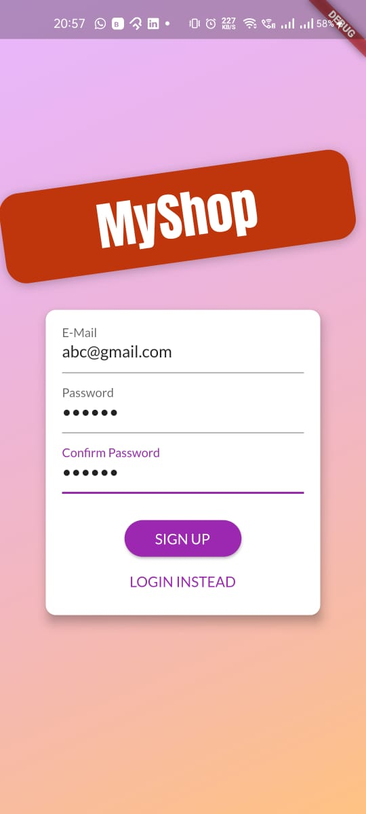

# ShopApp

- This is a demo mobile Application which has all basic features of a normal shopping app like adding to cart, checking out an order, managing products etc.

- I have used Firebase for user Authentication but the authentication code is made such that it will work for all backends and not only Firebase.

- I have used Provider package for state management.

- I created this app just for education purpose to learn how to implement authentication using Firebase and how to do state management using provider package.

## Images

#### Login Screen

#### Sign Up Screen

#### Sign Up Error

#### Products Overview Screen

#### Cart Screen

#### AppBar

#### Orders Screen

#### Manage Products Screen

#### Edit Product Screen

#### Product Detail Screen
